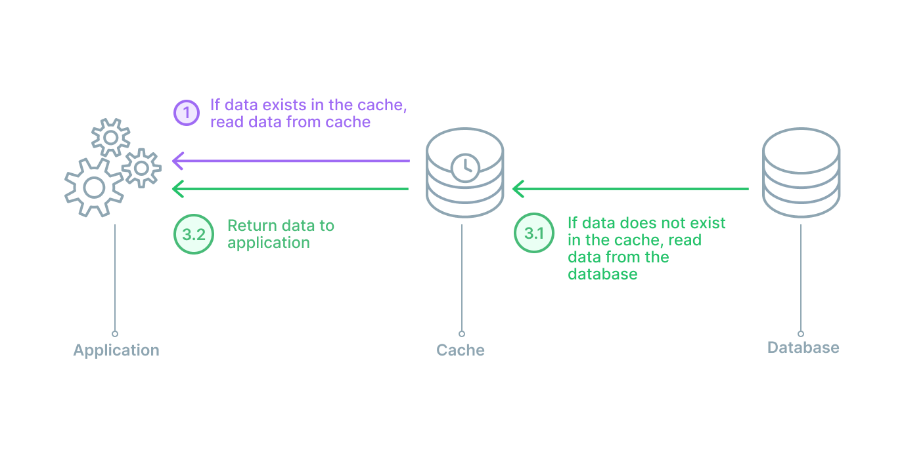

https://coolshell.cn/articles/17416.html

There are 4 commonly used cache updating patterns:

* Cache aside 
* Read through 
* Write through 
* Write behind (back)

4 scenarios (state, if see it as a state machine) to handle, write back mode has more.

* read, cache hit
* read, cache miss
* write, cache hit
* write, cache miss

2 threads

* client thread
* cache thread

2 modes

* cache mode, cache just a piece of memory
* cache is a data store service

How to update cache and DB

* the order
* when to update
* who, which thread

# Cache aside

## How it works

At the beginning, cache is just a piece of memory, driven by client thread.

* the flag

    In order to maintain the consistency between DB and cache, we need to know if cache is consistent with DB, instead of comparing it every time, we introduce a boolean flag to represent if data is in cache, so called cache hit.

* update DB

    Regarding how to update, if we write cache first, we may lose changes, DB is still the main store of the data, so we update DB first, cache later.

    after DB updated, if object is not in cache, we do nothing. if object in cache already, instead of update cache immediately, we just update the flag to invalidate the cache, which is cheaper, and according to Quora[4], can avoid some concurrency problem.

* update cache

    when a cache reading coming, which meets cache invalid, the client thread will read DB first, and write to cache.

4 states

    S2 - read, cache miss

    1. read from DB
    2. update cache

    S3

    1. write to DB
    2. invalidate cache

    S4, update DB only

    client thread do above.

* a typical error
* How it works
* paper of Facebook, question on Quora
* potential problem
    - how to avoid

## A potential concurrency issue

As described in the article, a problem may occur like below:

## see also

There is a paper "Scaling Memcache at Facebook" [3] and question on Quora [4].

# Read through

Instead of a piece of shared memory, in this pattern, we make cache a service.

"Cache aside" use client thread to update cache, may have concurrency issues.

Read / Write through use server side thread to update cache, avoid concurrency problem.

read through is similar to cache aside, the difference is cache thread update cache and DB.

# Write through

S2 is same with read through.

*S3 update Cache first, then DB

    this is faster then read through, but with weaker consistency

S4 update DB only

# Write back

according to [5a], initially, writing is done only to the cache. The write to the backing store is postponed until the modified content is about to be replaced by another cache block.

more complex, update cache only, update DB async. in batch.

we introduced one flag here, if data is dirty, i.e. in cache , not in DB yet.

so each of 4 scenarios before split into 2, dirty or not dirty.

see also [5c]

# Summary

Author mentioned principles in computer design could be used in IT system architecture.
for example cache, data pipelines etc. please refer to book "Computer Organization and Design: The Hardware/Software Interface"[6].

# Ref

1. article on coolshell https://coolshell.cn/articles/17416.html

2. 6.824 cache consistency

    a. notes: https://pdos.csail.mit.edu/6.824/notes/l-frangipani.txt

    b. video: https://youtu.be/jPrUxfIcWWs

    c. paper: https://pdos.csail.mit.edu/6.824/papers/thekkath-frangipani.pdf
    
3. Facebook paper

    https://research.facebook.com/publications/scaling-memcache-at-facebook/

4. Quora, Why does Facebook use delete to remove the key-value pair in Memcached instead of updating the Memcached during write request to the backend?

    https://www.quora.com/Why-does-Facebook-use-delete-to-remove-the-key-value-pair-in-Memcached-instead-of-updating-the-Memcached-during-write-request-to-the-backend

5. Cache wikipedia

    a. https://en.wikipedia.org/wiki/Cache_(computing)

    b. https://en.wikipedia.org/wiki/Cache_coherence

    c. https://en.wikipedia.org/wiki/Page_cache

6. Computer Organization and Design: The Hardware/Software Interface

    https://www.amazon.com/Computer-Organization-Design-MIPS-Architecture/dp/0124077269

    
7. other

    a beginner guide o cache sync.

    https://vladmihalcea.com/a-beginners-guide-to-cache-synchronization-strategies/