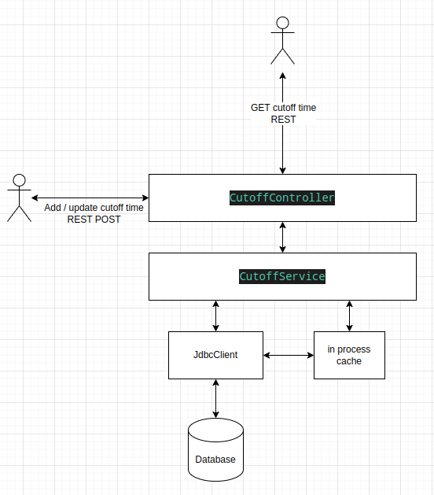

# Cutoff Time Service

This service implemented a simple REST service which can return currency pair cut-off time of given date.

It can also gets updates of currency cutoff times from external source.

# 1. Setup and configuration

This service is build on

- Spring Boot 2.6.0
- HikariCP 5.0.1
- Gradle 7.5.1
- PostgreSQL 9.3.24

In order to make this service work, we need to setup a database, which is PostgreSQL, the script used to create tables at:

    src/main/resources/sql/Tables.sql

then we need to fill the table pair_config with some currency pair configurations. with script:

    src/main/resources/sql/tableData/pair_config_insert.sql

then we need to change database url, to point to the databse we used in

    src/main/java/cutoff/jdbc/JdbcConfig.java

    ...

    public static final String JDBC_URL = "jdbc:postgresql://localhost:5432/mydb?user=postgres&password=postgres";

then we can rebuild project or start from Intellij, then end point should be:

    http://localhost:8080/cutoff

since the database tables are empty, we need to initilize cutoff times as listed in assignment for 29 currencies. with 2nd curl command in

    src/main/resources/curl.txt

    curl -X POST http://localhost:8080/cutoff -H 'Content-Type: application/json' -d '{"updates":[{"base":"AED","dateTime":"2022-10-18T00:00"} ...

now we use GET with parameters to get cutoff time of pairs like:

        curl -X GET 'http://localhost:8080/cutoff?pair=EUR/GBP&date=2022-10-18'

        response: 16:00

# 2. End point

The defaul end point is

    http://localhost:8080/cutoff

## 2.1 Get cutoff time

you can get cutoff time of given pair and date by GET method with parameters, for example:

    http://localhost:8080/cutoff?pair=EUR/GBP&date=2022-10-18

**We hard-codeds date, so only 2022-10-18, 2022-10-19, 2022-10-20 are valid dates, only pairs with currencies in assignment are valid pairs.**

in normal case, response will be a valid time like:

    16:00

in case of "Never possible", you will get:

    00:00

in case of "Always possible", you will get:

    23:59

if not data found you will get:

    "Not available"

The consideration of returning "00:00" and "23:59" is that it will be more consistent with the result, and assume that consumer of this service will distinguish time before and after cutoff time, which 00:00 will make all time after cutoff time.

## 2.2 Update pair cutoff times

In real production, cutoff time can not be static, we are getting new updates all the time, so we also support post to the same end point to update pair cutoff times, like

    curl -X POST http://localhost:8080/cutoff -H 'Content-Type: application/json' -d '{"updates":[{"base":"AED","dateTime":"2022-10-18T15:00"}]}'

above request will add / update cutoff time of "AED" on 2022-10-18 to 15:00.

ideally, we can read update from Kafka or other data source as well.

# 3. Implementation

The service are implemented as below:

## 3.1 Components

main components include:

- REST controller handle GET and POST, can get and update cutoff times
- CutoffService as @Service with main logic
- In process cache, which is a ConcurrentHashMap, key like "EUR/USD_2022-10-18"
- JdbcClient to access database
- database with 3 tables

# 3.2 Scenarios

- Application start

  When the service start, CutoffService will load cutoff times of recent 3 business days into to cache. Which pair should be in cache can be configured in table pair_config.

- Get cutoff time

  When user get cutoff time from REST service, the service will

  1. check if given pair + date is in the cache
  2. if not in cache, check inverse pair,
  3. if still not in cache, check database table pair_cutoff,
  4. then return cutoff time or "Not avilable".

- Update cutoff time

  when operator update cutoff time via POST, can be a list of "currency + date + time", service will update databaes and cache as below:

  1. add new updates to table cutoff_updates
  2. if it is the 1st cutoff time event for a given date, insert all configured pairs to table pair_cutoff with given date with null cutoff time
  3. update all records in table pair_cutoff with given currency, on given date, and cutoff time is null or later
  4. find all updated records and update cache

## 3.3 Database

we used 3 tables as below, please find in

    src/main/resources/sql/Tables.sql

- pair_config

  This table configured which pair should we maintain cutoff time with and if pair should be in cache. data see

  src/main/resources/sql/tableData/pair_config_insert.sql

- pair_cutoff

  This table have all pairs with cutoff time of date, some frequently trades paris also in cache, data see:

  src/main/resources/sql/tableData/pair_cutoff.sql

- cutoff_updates

  This table is append only, which records updates of currency cutoff times. data is from assignment document. data see:

  src/main/resources/sql/tableData/cutoff_updates.sql

## 3.4 The application

The application is a typical Sprint Boot based REST service, with components below:

- CutoffController

  Spring REST controller which handle GET and POST.

- CutoffService

  Spring @Service which implemented the main logic.

- CutoffTimeCache

  Cutoff time cache which speed up the query.

- JdbcClient

  JdbcClient which used to access database, with HikariCP connetion pool. We could use JPA or Hibernate, but think Jdbc could be more flexiable good enough in this case.

- package cutoff.model

  Data models.

# Design considerations

- Event driven

  We try to implement a Event Driven architeture, for example a cutoff time update is an event, it will update database and cache, we can add more event as needed. currently, we use REST and table to pass and record event, but we can also use Kafka or other message queue, observer patterns etc.

- Optimized for reading

  we try to reduce the latency of get cutoff time to the minimum, so we use a in process cache to cache all main pairs, so we can return the response quiclkly.

  For data struture, a Map should be a natural choice for this use case. since rest service are multithread, and also we need to modified cache concurrently, so it is reasonable use a ConcurrentHashMap.

  Like database table with index can speed up the reading but inserting will be slow, when new cutoff time arrive, we need to update both database and cache, which make writing slower.
  but we can also optimize it make writing asynchronously and multithread. Like Kafka's is log based, we can implement writing just append the new record and return, update table and cache can be handled by another thread(s) can also speed up the writing.

- Database tables

  we have 3 tables for different purpose, table pair_config could be controlled by other business department to specify what we can do to each pairs.

  table cutoff_updates served as a append only records for incoming updates, which simulate the idea of Kafka or write-ahead log in database. In case something is wrong, we can still recover the state from it.

  pair_cutoff contains all data for pair, date and cutoff times, which is efficient for query.

- Concurrency

  we need to keep in mind the service is multi thread, so we use ConcurrentHashMap for shared data, other class should be stateless so they do not have thread-safe problem.

- JPA vs JDBC

  actually, we can consider use Hibernate or JPA to access database, but since this example is simple and we want more flexibility, so Jdbc + connection pool should also be acceptable.

# What can be improved

Since the time is limited, there are definitly a lot of things we can improve include:

- More unit tests

  we can add more unit tests, since methods are all simple and small, it should be an easy task.

- Kafka for data synchronization

  ideally, in production, if we have Kafka or RabbitMQ which can transfer event like updates, it will be more loose coupling and scalable.

- Swagger

  we can use Swagger for better user interface.

- Other non-functional aspects

  There are lots of things we should consider in case if it is a real production ready service, for example, we should consider fault tolerant, scalability, performance, easy to maintain and better visibility etc.

# File list

Here listed files in the repository.

| folder                            | description                               |
| --------------------------------- | ----------------------------------------- |
| doc                               | documents                                 |
| src/main/java                     | java code                                 |
| src/main/resources/sql/Tables.sql | sql script used to create database tables |
| src/main/resources/sql/tableData  | files contains data in database           |
| src/main/resources/curl.txt       | REST request in curl                      |
